# Breno Alvim

Desenvolvedor web focado em interfaces e ferramentas que resolvem problemas reais. Trabalho com TypeScript, Next.js e React no dia a dia, e tenho um apreço particular por projetos que combinam design e utilidade.

<h3><code>obrenoalvim@github ~ $ ./contributions.sh</code></h3>

  

<h3><code>obrenoalvim@github ~ $ whoami</code></h3>

## Contato

- LinkedIn: [linkedin.com/in/obrenoalvim](https://linkedin.com/in/obrenoalvim)
- Email: brenoalvim.dev@gmail.com
- Portfolio: [githubportifoliogenerator.vercel.app/obrenoalvim](https://githubportifoliogenerator.vercel.app/obrenoalvim)
